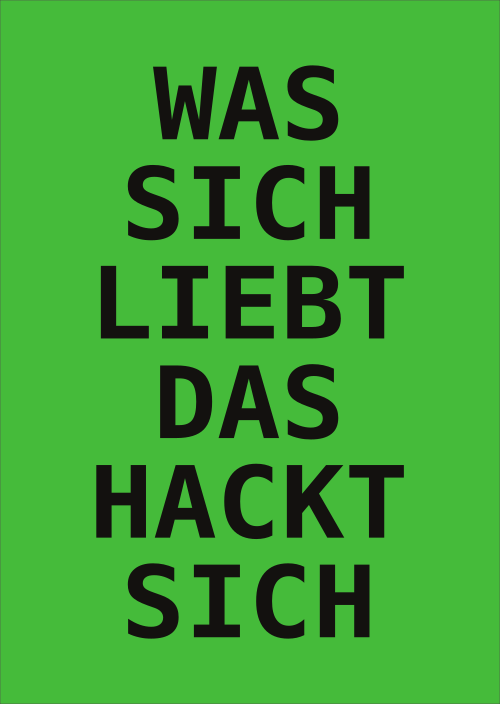

Stickers
========

This repo includes the sources that were used to print the following stickers:

### "WAS SICH LIEBT DAS HACKT SICH"

### "WAS MICH LIEBT DAS HACK' ICH"

### "WAS ICH LIEB' DAS HACKT MICH"

### "WAS ICH LIEB' DAS HACK' ICH"

License
-------

The font [Hack](https://github.com/source-foundry/Hack) was used for the design above and is [MIT-licensed](https://github.com/source-foundry/Hack/blob/bf708677c2b261af77b1de22c5439589c23a3080/LICENSE.md).

Everything else that is not covered by the above, is CC0-Licensed.

Further reading
---------------

[Wiktionary (german)](https://de.wiktionary.org/wiki/was_sich_liebt,_das_neckt_sich)
